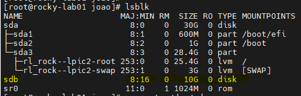
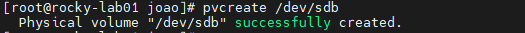
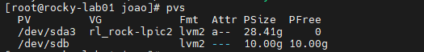
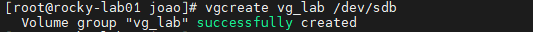
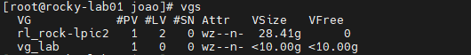
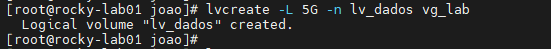
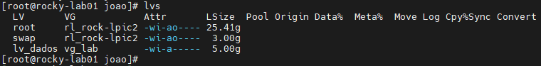
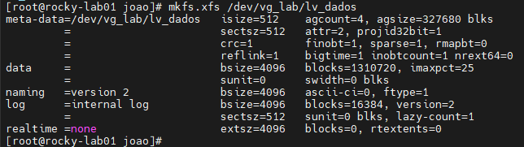
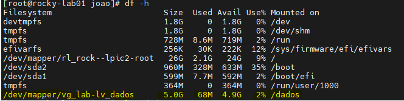

# 💾 LVM
## Como criar um novo volume LVM

Este procedimento cria um novo volume LVM utilizando um disco já conectado ao servidor.

## Identificar o disco

```bash
lsblk
```

Exemplo:



```text
sdb    10G disk
```

---

## Criar o Physical Volume (PV)

```bash
pvcreate /dev/sdb
```



Verificar:

```bash
pvs
```


---

## Criar o Volume Group (VG)

```bash
vgcreate dados-vg /dev/sdb
```


Verificar:

```bash
vgs
```

---

## Criar o Logical Volume (LV)

Adicionando 5G do dico disponível:

```bash
lvcreate -l 5 -n dados-lv dados-vg
```


Verificar:

```bash
lvs
```

---

## Criar o filesystem

XFS:

```bash
mkfs.xfs /dev/dados-vg/dados-lv
```

ou EXT4:

```bash
mkfs.ext4 /dev/dados-vg/dados-lv
```


---

## Criar o ponto de montagem

```bash
mkdir /dados
```

---

## Montar o volume

```bash
mount /dev/dados-vg/dados-lv /dados
```

Validar:

```bash
df -h
```

---

## Configurar montagem automática

Obter o UUID:

```bash
blkid
```

Editar:

```bash
vi /etc/fstab
```

Adicionar:

```text
UUID=xxxxxxxx-xxxx-xxxx-xxxx-xxxxxxxxxxxx /dados xfs defaults 0 0
```

Testar:

```bash
mount -a
```

---

## Estrutura criada

```text
Disco (/dev/sdb)
   ↓
PV
   ↓
VG (dados-vg)
   ↓
LV (dados-lv)
   ↓
Filesystem (XFS)
   ↓
/dados
```

---

## Resumo

```bash
pvcreate /dev/sdb

vgcreate dados-vg /dev/sdb

lvcreate -l 100%FREE -n dados-lv dados-vg

mkfs.xfs /dev/dados-vg/dados-lv

mkdir /dados

mount /dev/dados-vg/dados-lv /dados

blkid

vi /etc/fstab

mount -a
```
